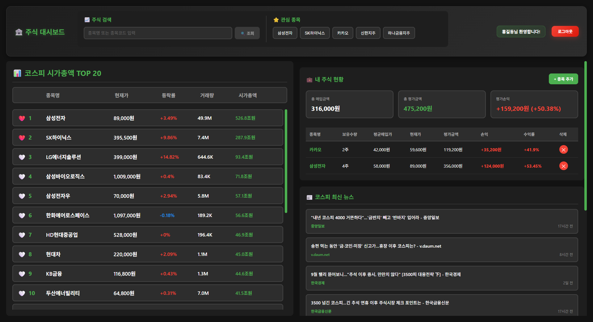
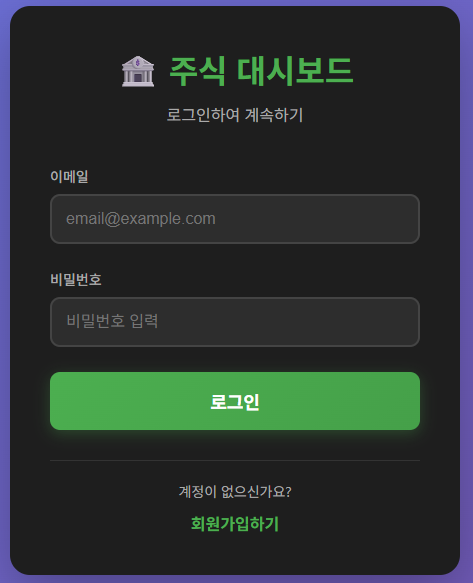
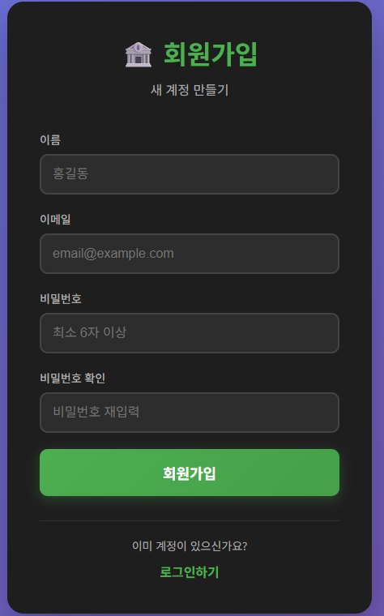

# 📈 주식 대시보드 프로젝트 (Stock Dashboard Project)

**Vue 3와 FastAPI를 활용한 실시간 주식 정보 대시보드 및 포트폴리오 관리 시스템**

---

## 🌟 프로젝트 소개

본 프로젝트는 한국투자증권 OpenAPI를 활용하여 실시간 주식 데이터를 제공하고, 사용자가 자신만의 포트폴리오와 관심 종목을 관리할 수 있는 풀스택 웹 애플리케이션입니다.

- **Frontend**: Vue 3와 Vite를 사용하여 반응형의 인터랙티브 UI를 구축했습니다.
- **Backend**: FastAPI를 기반으로 고성능 비동기 API 서버를 구현했습니다.



---

## ✨ 주요 기능

### 사용자 인증
- 🔐 JWT 기반의 안전한 회원가입 및 로그인
- 🛡️ 페이지 접근 제어를 위한 라우터 가드

### 실시간 주식 정보
- 📊 **시가총액 TOP 20** 실시간 순위 제공
- 💹 종목별 **현재가, 상세 정보, 투자 지표** 조회
- 📈 **기간별 주가 차트** 시각화 (Chart.js)
- 📰 **종목별/시장 전체 뉴스** 피드 (Google News RSS)

### 개인화 기능
- 🔍 **자동완성 검색**으로 빠르고 편리한 종목 검색
- ⭐ **관심 종목** 등록 및 관리
- 💼 **포트폴리오 관리** (보유 종목 추가/삭제)
- 💰 **실시간 평가손익 및 수익률** 자동 계산

---

## 🖼️ 주요 화면 스크린샷

| 로그인 | 회원가입 | 메인 대시보드 |
| :---: | :---: | :---: |
|  |  |  |

| 종목 상세 (주가) | 종목 상세 (지표) | 포트폴리오 추가 |
| :---: | :---: | :---: |
|  |  |  |

---

## 🛠 기술 스택 및 아키텍처

### 시스템 아키텍처
```
  [Client: Vue.js] <--> [Web Server: FastAPI] <--> [Database: PostgreSQL]
       ^                      ^                            ^
       |                      |                            |
[Browser]               [Korea Investment API]      [Google News RSS]
```

### Backend (FastAPI)
- **Framework**: FastAPI, Python 3.11+
- **Database**: PostgreSQL, SQLAlchemy (ORM)
- **Authentication**: JWT (python-jose), bcrypt
- **API**: 한국투자증권 OpenAPI, Google News RSS
- **Server**: Uvicorn (ASGI)

### Frontend (Vue.js)
- **Framework**: Vue 3 (Composition API)
- **Build Tool**: Vite
- **State Management**: Pinia (`useAuth` composable)
- **Routing**: Vue Router
- **HTTP Client**: Axios
- **Charting**: Chart.js

---

## 🚀 설치 및 실행 방법

### 1. 사전 요구사항
- Python 3.11+
- Node.js 18+
- PostgreSQL 14+
- 한국투자증권 API 키 (앱키, 앱시크릿, 계좌번호)

### 2. Backend 서버 실행
```bash
# 1. StockProject/backend 경로로 이동
cd StockProject/backend

# 2. 가상환경 생성 및 활성화
python -m venv venv
# Windows
venv\Scripts\activate
# macOS/Linux
# source venv/bin/activate

# 3. 의존성 패키지 설치
pip install -r requirements.txt

# 4. .env 파일 생성 및 환경변수 설정
# (backend/README.md 참고)
# DATABASE_URL, JWT, 한국투자증권 API 키 등

# 5. 데이터베이스 테이블 생성 및 데이터 로드
python database.py
python load_stocks.py kospi_code_name.xlsx

# 6. 백엔드 서버 실행
uvicorn app:app --reload --host 0.0.0.0 --port 8000
```
> 백엔드 서버가 `http://localhost:8000`에서 실행됩니다.

### 3. Frontend 서버 실행
```bash
# 1. 새 터미널을 열고 StockProject/frontend 경로로 이동
cd StockProject/frontend

# 2. 의존성 패키지 설치
npm install

# 3. 프론트엔드 개발 서버 실행
npm run dev
```
> 프론트엔드 서버가 `http://localhost:5173`에서 실행됩니다. 이제 브라우저에서 접속하여 서비스를 이용할 수 있습니다.

---

## 📁 프로젝트 구조

```
StockProject/
├── backend/                # FastAPI 백엔드
│   ├── routers/
│   ├── services/
│   ├── schemas/
│   ├── app.py
│   ├── database.py
│   ├── requirements.txt
│   └── README.md           # (백엔드 상세 문서)
│
├── frontend/               # Vue.js 프론트엔드
│   ├── src/
│   │   ├── components/
│   │   ├── views/
│   │   ├── router/
│   │   └── stores/
│   ├── package.json
│   └── README.md           # (프론트엔드 상세 문서)
│
├── docs/
│   └── images/             # README용 스크린샷
│
└── README.md               # (현재 파일)
```

---

## 👨‍💻 개발자

- **곽윤철**
- **Email**: kyc4061@daum.net
- **GitHub**: [https://github.com/YunCheol07](https://github.com/YunCheol07)
